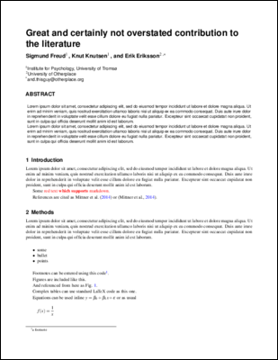
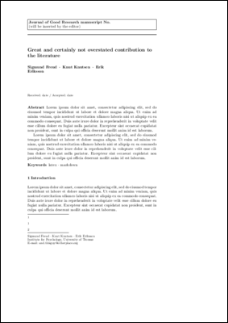

# markdown-paper

Scientific paper in markdown using LaTeX. See the [pdf-directory](pdf/) for examples.
</img>
</img>
</img>

- [markdown-talk](https://github.com/ihrke/markdown-talk) - template for a beamer-based presentations
- [markdown-letter](https://github.com/ihrke/markdown-letter) - template for a letters
- [markdown-notes](https://github.com/ihrke/markdown-notes) - template for a notes

The source of this document is written in [markdown](https://daringfireball.net/projects/markdown/) (file `paper.md`) and translated to latex using [pandoc](http://pandoc.org/) and customized templates located in the `templates` folder. References are stored in `references.bib` in [bibtex](http://www.bibtex.org/) format.

The `Makefile.template` file details how the translation works. 

There is a convenience script `build.py` that creates a `Makefile` from `Makefile.template` that is consistent with the desired template as specified in the `template` field in the markdown-header. All supported templates are listed in `conf.py`.  Which template to use is specified in the header of the `.md`-file using the `template:` field. If the template is not changed, `build.py` does not need to be rerun but simply calling `make` will suffice. It is also possible to specify the desired template on the command-line using the `-t <template name>` option. See `python build.py -h` for details. Note, however, that not all variables are implemented for all templates.

If you are on linux, simply calling `make` in the parent directory will compile the report to a pdf-format if all dependencies are installed.

## Supported templates

This is a list of all supported templates along with a list of all variables defined for each template. It is generated using `tools/templatevar.py` and may or may not be outdated.

elsevier
--------
- `abstract`
- `acknowledgements`
- `additionalinformation`
- `affiliation`
- `affiliation.name`
- `affiliation.number`
- `author-meta`
- `author.address`
- `author.email`
- `author.footnote`
- `author.name`
- `bibliography`
- `body`
- `citecolor`
- `contribution`
- `journal`: journal name (str)
- `keyword`
- `linkcolor`
- `title`
- `title-meta`
- `toc-depth`
- `urlcolor`

scientific_reports
------------------
- `abstract`
- `acknowledgements`
- `additionalinformation`
- `affiliation.name`
- `affiliation.number`
- `author.email`
- `author.footnote`
- `author.name`
- `bibliography`
- `body`
- `contribution`
- `keyword`
- `title`

springer
--------
- `abstract`
- `acknowledgements`
- `additionalinformation`
- `author.email`
- `author.footnote`
- `author.institute`
- `author.name`
- `bibliography`
- `body`
- `documentclass_options`
- `journal`
- `keyword`
- `svjourstyle`
- `title`
- `toc-depth`

wiley
-----
- `abbreviation`
- `abstract`
- `acknowledgements`
- `additionalinformation`
- `affiliation.name`
- `affiliation.number`
- `author`
- `author.email`
- `author.footnote`
- `author.institute`
- `author.name`
- `bibliography`
- `body`
- `contribution`
- `funding`
- `journalsection`
- `keyword`
- `papertype`
- `title`

## Usage

1. Install the dependencies

    ~~~{bash}
    sudo apt-get install pandoc pandoc-citeproc
    pip install pandoc-fignos
    ~~~
2. Clone this repository

    ~~~{bash}
    git clone
    ~~~
3. Edit `Makefile` to choose a template
4. Write paper in `paper.md`, refs in `references.bib`, compile with `make`

NOTE: `paper.md` contains example code for tables, figures, equations, references and so on.

## Dependencies

- [pandoc](http://pandoc.org/)
- [pandoc-fignos](https://github.com/tomduck/pandoc-fignos)
- [pandoc-citeproc](https://github.com/jgm/pandoc-citeproc)
- a [latex](https://www.latex-project.org/)-distribution (e.g., [texlive](https://www.tug.org/texlive/)) including [bibtex](http://www.bibtex.org/)

---

Matthias Mittner <matthias.mittner@uit.no>
